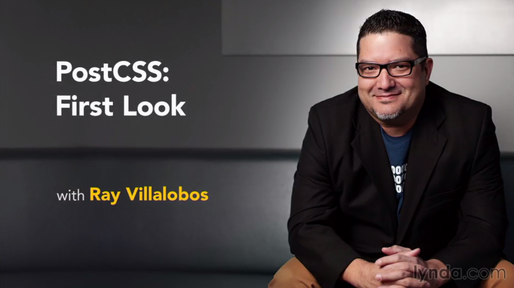

# PostCSS: First Look

This is the repository for my course, [PostCSS: First Look](http://www.lynda.com/CSS-tutorials/Building-Responsive-Single-Page-Design-PostCSS/417644-2.html). The full course is available at [lynda.com](http://lynda.com).

## Course Description
PostCSS is a CSS post-processor engine that allows you to transform regular CSS through JavaScript plugins. Like LESS, Sass, and Stylus, these plugins allow you to use CSS in new and exciting ways like automatically prefixing your CSS for older browsers; adding variables, conditionals, or nesting; and even transpiling next-generation CSS so that it works in older browsers today. PostCSS can be 3–30 times faster than other pre-processors and offers a modular approach, so you can install just the plugins you want to use.

In this short course, you'll learn how to set up a workflow for Gulp.js using PostCSS, which can speed up the way you build websites and change the way you write CSS. Author Ray Villalobos will also introduce the most useful PostCSS plugins, including cssnano, Autoprefixer, cssnext, and PreCSS.

## Instructions
This repository has branches for each of the videos in the course. You can use the branch pop up menu in github to switch to a specific branch and take a look at the course at that stage. Or you can simply add `/tree/BRANCH_NAME` to the URL to go to the branch you want to peek at.

1. Make sure you have these installed
	- [node.js](http://nodejs.org/)
	- [git](http://git-scm.com/)
	- [gulp](http://gulpjs.com/)
2. Clone this repository into your local machine using the terminal (mac) or Gitbash (PC) `> git clone https://github.com/planetoftheweb/postcss.git`
3. CD to the folder `cd postcss`
4. Run `> npm-install` to install the project dependencies
5. Install gulp.js via the Mac terminal or Gitbash on a PC `> npm install -g gulp`
5. Run the Gulp command `> gulp`
6. Fire up your browser at `http://localhost:8080`

For more help setting up a comprehensive Gulp.js workflow, check out [Web Project Workflows with Gulp.js, Git, and Browserify](http://www.lynda.com/Web-Web-Design-tutorials/Web-Project-Workflows-Gulpjs-Git-Browserify/154416-2.html).

## More Stuff
Check out some of my [other courses on lynda.com](http://lynda.com/rayvillalobos). You can also check out my [youtube channel](http://youtube.com/planetoftheweb), [follow me on twitter](http://twitter.com/planetoftheweb), or read [my blog](http://raybo.org).
